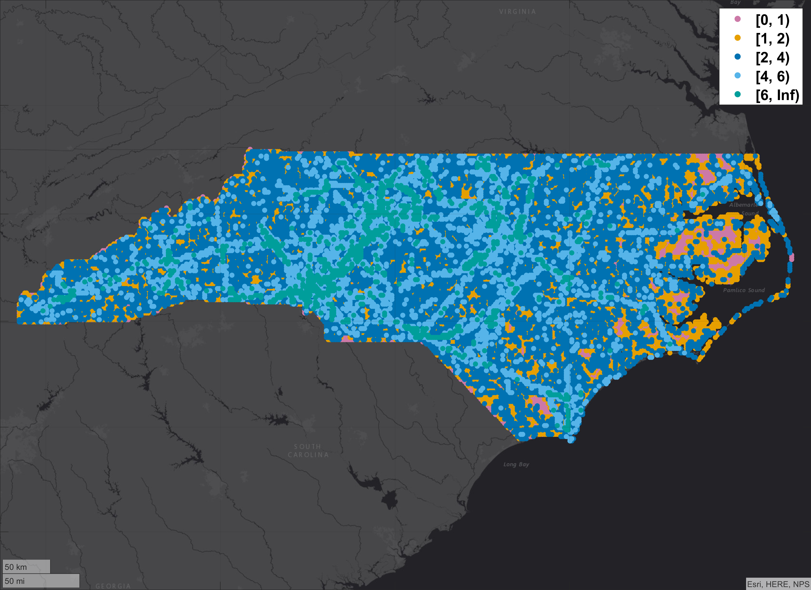

# em-pairing-geospatial

This repository is a collection of MATLAB code to generate uncorrelated encounters between aircraft near sampled geospatial coordinates. It based on the high level concepts discussed in [*Representative Small UAS Trajectories for Encounter Modeling*](#citation). The generated encounters have successfully been implemented in the MIT LL CSIM, MIT LL CASSATT, and JHU APL RAVENS simulation environments.

- [em-pairing-geospatial](#em-pairing-geospatial)
  - [Introduction](#introduction)
    - [Motivation](#motivation)
    - [Uncorrelated Assumption](#uncorrelated-assumption)
    - [Contribution](#contribution)
  - [Method](#method)
  - [Run Order](#run-order)
    - [Confirm Persistent System Environment Variable](#confirm-persistent-system-environment-variable)
    - [em-core](#em-core)
    - [Generate trajectories](#generate-trajectories)
    - [Identify Pairs (RUN_1*)](#identify-pairs-run1)
      - [Parameters: findPairs_1](#parameters-findpairs1)
      - [Plotting](#plotting)
    - [Generate Encounters (RUN_2*)](#generate-encounters-run2)
      - [Parameters: createEncounters_2](#parameters-createencounters2)
  - [Example Encounters](#example-encounters)
    - [Encounter Dynamics](#encounter-dynamics)
      - [Crossing, US-TN](#crossing-us-tn)
      - [Parallel, US-TN](#parallel-us-tn)
    - [Location](#location)
      - [Shoreline, US-VA](#shoreline-us-va)
      - [Waterway, US-TN](#waterway-us-tn)
    - [Multiple Encounters Per Anchor Point](#multiple-encounters-per-anchor-point)
      - [Railway, US-TN](#railway-us-tn)
      - [Roadway, US-TN](#roadway-us-tn)
    - [Track Length](#track-length)
      - [Agriculture, US-KS](#agriculture-us-ks)
      - [Electric Transmission, US-VA](#electric-transmission-us-va)
  - [Discussion](#discussion)
    - [Location Sensitivity](#location-sensitivity)
    - [Distribution of Encounters](#distribution-of-encounters)
      - [All Potential Operations](#all-potential-operations)
      - [Long Linear Infrastructure](#long-linear-infrastructure)
        - [All Long Linear Infrastructure](#all-long-linear-infrastructure)
        - [Railway Only](#railway-only)
      - [Agriculture Only](#agriculture-only)
  - [Waypoint Format](#waypoint-format)
  - [Output Directory](#output-directory)
  - [Citation](#citation)
  - [Distribution Statement](#distribution-statement)

## Introduction

The continuing integration of unmanned aerial system operations into the National Airspace System requires new or updated regulations, policies, and technologies to maintain safety and enable efficient use of the airspace. Simulation-based methods have routinely been used as part of development of aviation safety systems or to inform regulations.

### Motivation

Monte Carlo safety simulations have long been a key capability used by the aviation regulators to develop, assess, and certify aircraft conflict avoidance systems that mitigate the risk of airborne collisions. These simulations and their associated models have been used to characterize the performance of surveillance systems, assess the behavior of conflict avoidance algorithms, and estimate overall system collision risk performance. Specifically, Monte Carlo simulations help evaluate systems that enable aircraft to not operate so close to each other other to create a collision hazard, in accordance with [14 CFR § 91.111](https://www.law.cornell.edu/cfr/text/14/91.111).

The following figure illustrates an example Monte Carlo framework. Encounter models are key to accurate Monte Carlo simulations, as the models are sampled to produce representative trajectories that are paired to create feasible encounters between aircraft. These encounters are then often assessed in a fast-time simulation. This repository takes independent trajectories as input and outputs paired aircraft encounters.


### Uncorrelated Assumption

The software generates uncorrelated encounters, which assume the aircraft trajectories independent and that there is no dependence on the encounter geometry or aircraft behavior before a collision avoidance system acts. It is assumed that air traffic control or an active unmanned traffic management system is not providing guidance. This uncorrelated assumption enables individual aircraft trajectories can be modeled independently and then combined in a separate encounter initialization process. This software focused on that encounter process.

### Contribution

This software generates encounters between two aircraft that can directly support development of a broad range of standards or safety cases. It explicitly considers commonly used encounter model variables of geographic location, airspace class, and altitude layer. It also supports the sampling of airspeed and altitude for trajectories generated using `em-model-geospatial`.

## Method

First a uniformly spaced grid is generated. The default behavior is to bound grids based on an administrative boundary, such as the polygon of California. These polygons are sourced from [ISO-3166-2](https://en.wikipedia.org/wiki/ISO_3166-2). Then for each grid coordinate, nearby independent trajectories created using `em-model-geospatial` are identified. For UAS vs UAS encounters, this ensures that each encounter is feasible and can potentially occur in the airspace. However the likelihood for each feasible encounter is not estimated.

After the grid has been sampled, a set of encounter criteria is established. Criteria includes a horizontal and vertical conflict threshold that a valid encounter must satisfy by halfway into the encounter duration. Note that the thresholds are not sampled horizontal and vertical miss distances. Other criteria include initial horizontal separation, initial vertical separation and the range for sampled airspeeds and altitudes for trajectories generated using `em-model-geospatial`.

If a `em-model-geospatial` trajectory is to encounter a manned aircraft track generated using [`em-model-manned-bayes`](https://github.com/Airspace-Encounter-Models/em-model-manned-bayes), then a [`em-model-manned-bayes`](https://github.com/Airspace-Encounter-Models/em-model-manned-bayes) is loaded for each `em-model-geospatial` trajectory for each grid coordinate. Using [`placeTrack`](placeTrack.m), the [`em-model-manned-bayes`](https://github.com/Airspace-Encounter-Models/em-model-manned-bayes) tracks are translated from a local coordinate system to a geospatial system with the [`em-model-manned-bayes`](https://github.com/Airspace-Encounter-Models/em-model-manned-bayes) trajectory randomly flying through the associated grid coordinate. After translating, the Bayes track is verified to avoid obstacles and flight into terrain. The [`em-model-manned-bayes`](https://github.com/Airspace-Encounter-Models/em-model-manned-bayes) track maybe cropped to achieve this.

Then for each grid coordinate and pairs of tracks (multi-threat encounters are not currently supported), the distance between all waypoint combinations for the two tracks are calculated with [`findconflict`](findconflict.m). Waypoint combinations are filtered to those that meet the conflict threshold criteria. The airspeed and altitude are then sampled for `em-model-geospatial` tracks in [`samplespeedalt`](samplespeedalt.m). Next, both tracks are transformed from geodetic coordinates to local (north, east, altitude MSL) coordinates using [`geodetic2ned`](https://www.mathworks.com/help/map/ref/geodetic2ned.html). Lastly tracks are cropped to meet the encounter duration criteria in [`croptracks`](croptracks.m) and checked if the initial conditions are met in [`updatewaypointstruct`](updatewaypointstruct.m). Encounters are output in the [waypoint format](#waypoint-format).

## Run Order

Code developed and tested in Windows for Matlab R2018a and R2019b. The dev machine had a CPU of Intel Xeon Gold 6130 at 2.10GHz and 64 GB of RAM. The built-in Matlab function [`parfor`](https://www.mathworks.com/help/matlab/ref/parfor.html) is used routinely throughout the code. Majority of the computation intensive work is related to working with digital elevation models or loading files.

### Confirm Persistent System Environment Variable

Persistent system variables are used to reference different repositories within the Airspace Encounter Models organization. Confirm that they have been set.

| Variable Name  | Referring Repository |
| :------------- | :------------- |
`AEM_DIR_BAYES` | [`em-model-manned-bayes`](https://github.com/Airspace-Encounter-Models/em-model-manned-bayes)
`AEM_DIR_CORE` | [`em-core`](https://github.com/Airspace-Encounter-Models/em-core)
`AEM_DIR_GEOSPATIAL` | `em-model-geospatial`

### em-core

If you have not already, complete the initial setup associated with the [`em-core`](https://github.com/Airspace-Encounter-Models/em-core) repository.

### Generate trajectories

Using a model specific repository, such as [`em-model-manned-bayes`](https://github.com/Airspace-Encounter-Models/em-model-manned-bayes) or `em-model-geospatial`, generate uncorrelated independent trajectories.

### Identify Pairs (RUN_1*)

The [`RUN_1.m`](RUN_1.m) script calls [`findPairs_1`](findPairs_1.m) and determines which trajectories generated by `em-model-geospatial` are within the distance defined by `anchorRange_nm` of the coordinates specified by `gridLat_deg` and `gridLon_deg`. These coordinates are referred to as the "anchor point." As noted in the [Output Directory](#output-directory) section, the output of [`RUN_1.m`](RUN_1.m) uses the "pairs" prefix.

The high-level workflow for identifying feasible pairs and anchor points is:

1. Create a uniformly spaced grid across a region
2. Identify all potential UAS trajectories generated using `em-model-geospatial` in that region
3. Determine which `em-model-geospatial` trajectories are within the distance defined by `anchorRange_nm` of each grid point

#### Parameters: findPairs_1

The script is based on the [`findPairs_1`](findPairs_1.m) function, which has the following parameters:

| Parameter  | Example |  Description |
| :------------- | :-- | :------------- |
| inDir | `dir([getenv('AEM_DIR_GEOSPATIAL') filesep 'output' filesep 'trajectories' filesep 'US-MA' '*' filesep '*'])` | Cell array of directories from output of `em-model-geospatial/RUN_OSM_2_**.m`
| outHash | `all_US-MA` | Text to append to output filename
| gridLat_deg | N X 1 double column array | List of latitude coordinates in decimal degrees
| gridLon_deg | N X 1 double column array | List of longitude coordinates in decimal degrees
| anchorRange_nm | `1.25` | Maximum allowable distance.=, in nautical miles, aircraft can be away from a anchor point
| airspace | `[getenv('AEM_DIR_CORE') filesep 'output' filesep 'airspace-B-C-D-24-Oct-2019.mat']` | Output from `em-core/matlab/**/RUN_Airspace_1.m` |
| classInclude | `{'B','C','D','O'}` | Airspace classes to include
| spheroid | [`wgs84Ellipsoid('nm')`](https://www.mathworks.com/help/map/ref/wgs84ellipsoid.html) | [Reference ellipsoid](https://www.mathworks.com/help/map/reference-spheroids.html)
| isSave | `true` | If true, save to file

#### Plotting

The output of [`RUN_1.m`](RUN_1.m) can be visualized using [`PLOT_1.m`](PLOT_1.m). This script uses MATALB's [`geobasemap`](https://www.mathworks.com/help/matlab/creating_plots/access-basemaps-in-matlab.html) capabilities to color pairs of `gridLat_deg` and `gridLon_deg` coordinates by the number of geospatial trajectories within the `anchorRange_nm` distance. The [Discussion](#discussion) section includes example outputs of [`PLOT_1.m`](PLOT_1.m).

### Generate Encounters (RUN_2*)

`RUN_2*` scripts use the output of [`RUN_1.m`](RUN_1.m) to generate encounters between aircraft. Aircraft 1 can only be a representative UAS trajectory generated using `em-model-geospatial`. Aircraft 2 can either be a representative UAS trajectory or a sampled Bayes track from [`em-model-manned-bayes`](https://github.com/Airspace-Encounter-Models/em-model-manned-bayes). As noted in the [Output Directory](#output-directory) section, the output of a `RUN_2*` script uses the "enc" prefix.

Encounters are outputted in a serialized "waypoint" format consisting of initial and updates to position coordinates. Refer to [waypoint format](#waypoint-format) for more details.

#### Parameters: createEncounters_2

These scripts are based on the [`createEncounters_2`](createEncounters_2.m) function. The following are the some of the most important parameters, but this table is not comprehensive.

| Parameter  | Example | Description |
| :------------- | :--- | :------------- |
| inFile | `['output' filesep pairs-all_US-MA-anchorRange1.25.mat]` | Output from RUN_1
| encTime_s | `60` | Encounter duration in seconds
| thresHorz_ft  | `500` |Conflict range threshold in feet
| thresVert_ft  | `100` |Conflict vertical separation threshold in feet
| initHorz_ft | `[6076 15190]` | Initial horizontal range in feet
| initVert_ft | `[0 500]` | Initial vertical separation magnitude in feet
| maxEncPerPair | `10` | Maximum encounters to generate for each combination of anchor coordinates and aircraft tracks
| timeStep_s | `1` |Update rate in seconds
| isSampleAlt1 | `true` | If true, sample aircraft 1 AGL altitude from [`minAlt1_ft_agl` `maxAlt1_ft_agl`]
| minAlt1_ft_agl | `100` | Minimum sampled AGL altitude for aircraft 1
| maxAlt1_ft_agl | `400` | Maximum sampled AGL altitude for aircraft 1
| vrange1_kts | `[5 87]` | Minimum and maximum airspeed in knots of aircraft 1 (only if aircraft 1 isn't from a Bayes model)
| acmodel2 | `bayes` | Denote if aircraft 2 was generated either from the geospatial or bayes model
| demBayes | `dted1` | Digital elevation model to use when translating Bayes tracks from local (x,y,z) to (latitude, longitude, MSL altitude)
| z_agl_tol_ft| `250` | Altitude tolerance when translating to MSL altitude from a Bayes track sampled in AGL
| dofFile| `[getenv('AEM_DIR_CORE') filesep 'output' filesep 'dof-' '25-Feb-2020' '.mat']` | Output from `em-core/matlab/**/RUN_readfaadof.m`
| dofObs| `{'silo','tower','windmill'}` | Cell array of obstacles to include
| dofMinHeight_ft | `100` | Minimum height in feet of obstacles to include
| dofMaxRange_ft | `500` | Horizontal separation in feet between Bayes aircraft and center of obstacles
| dofMaxVert_ft | `50` | Vertical separation in feet between Bayes aircraft and the top of obstacles
| classInclude | `{'B','C','D','O'}` | Airspace classes to include
| spheroid | [`wgs84Ellipsoid('nm')`](https://www.mathworks.com/help/map/ref/wgs84ellipsoid.html) | [Reference ellipsoid](https://www.mathworks.com/help/map/reference-spheroids.html)
| isPlot | `true` | If true, plot trajectories and anchor points
| isZip | `true` | If true, will archive directory containing encounters into a single .zip file

## Example Encounters

This section discusses a several examples to highlight the output and characteristics of the encounter generation process. Each example consists of a UAS conducting a UAS-based inspection and encountering a 1200-code manned aircraft, per the extended uncorrelated Bayesian model. Encounters occur outside of terminal airspace and were generated using [`encTime_s=60`](#parameters-createencounters2), [`thresHorz_ft=2000`](#parameters-createencounters2), and [`thresVert_ft=200`](#parameters-createencounters2). The anchor coordinates were generated using [`anchorRange_nm=1.25`](#parameters-findpairs1).

### Encounter Dynamics

Foremost, the first two examples demonstrate that generating encounters based on geospatial samples can produce different types of encounters with just a few encounter criteria. Illustrated are a crossing encounter between a roadway inspection UAS and a 1200-code aircraft and then a parallel encounter with a UAS inspecting a railway. Besides encounter orientation, these examples demonstrate that the threshold criteria is different than sampling an unmitigated horizontal and vertical miss distance.

Additionally, observe that the second example has a potential crossing encounter outside of the anchor radius defined by [`anchorRange_nm`](#parameters-findpairs1). However, since the intersection occurs farther than 1.25 nautical miles from the anchor point, it was not considered.

#### Crossing, US-TN


#### Parallel, US-TN


### Location

The next figures demonstrate how sampled anchor points can yield different environmental conditions. Encounters can be simulated near flat terrain or more mountainous terrain; and near varying population densities. This illustrates that the use of digital elevation models and obstacle data are critical for validating that encounters are feasible.

#### Shoreline, US-VA


#### Waterway, US-TN


### Multiple Encounters Per Anchor Point

The next two figures illustrate how multiple encounters can be generated from the same anchor point. Representative railway and roadway inspections both can occur near the anchor point. A different Bayesian trajectory was paired for each of the inspection trajectories. There are three distinctions between these encounters. First, that a different manned trajectory, each with a different rotation when placed in the environment, was paired for each unmanned track. Second, the manned trajectory flies through the anchor point at different points along their trajectories. Third due to the preceding distinctions and the differences of the railway and roadway trajectories, the number of track combinations that satisfy the conflict thresholds differ.

#### Railway, US-TN


#### Roadway, US-TN


### Track Length

The last example is an illustration without a dependence on sampled track length when pairing aircraft. The agriculture example has a short UAS track while the electric transmission example has a short manned track. Track length is dependent upon a variety of factors but for the encounter generation process, tracks just need to be long enough to satisfy [`encTime_s`](#parameters-createencounters2) and the initial conditions defined by [`initHorz_ft`](#parameters-createencounters2) and [`initVert_ft`](#parameters-createencounters2). If these are satisfied, encounters can be generated based on the conflict threshold. Moreover, an aircraft can initialize outside of the anchor radius but conflicts can only occur near the anchor point.

#### Agriculture, US-KS


#### Electric Transmission, US-VA


## Discussion

Using the [plotting tools](#plotting), we can illustrate the sensitivity and importance of having a diverse and set of geospatial trajectories generated using `em-model-geospatial`.

### Location Sensitivity

First we compare the distribution of potential encounters between US-NV and US-NC, when [`anchorRange_nm=1.25`](#parameters-findpairs1) in [`RUN_1.m`](RUN_1.m). The distribution of the bluer points, which indicate more nearby geospatial trajectories, varies significantly between US-NV and US-NC. In particular, US-NV highlights the clustering of different types of long linear infrastructure. US-NC has more coordinates with six or more potential trajectories within 1.25 nautical miles. When US-NV is compared to US-NC, with a greater population density and more developed land, the differences in the examples illustrate how location can affect encounter generation and potential encounter likelihood.




### Distribution of Encounters

The next series of figures illustrate how the distribution of potential encounters is not uniform across a region.

#### All Potential Operations

The next figure illustrates the output of [RUN_1](#identify-pairs-run1) when `usecase = all-noshield` and [`anchorRange_nm=1.25`](#parameters-findpairs1). Note that the distribution of potential encounters is not uniform across US-KS. As expected, there is a greater density of features near population centers and there is an inherent structure to how potential UAS operations are distributed across a large region.

Additionally representative trajectories are based on the available data and the number of use cases supported by `em-model-geospatial` are growing. Yet a comprehensive list of all potential UAS operations across all geospatial points is not available and likely never will be available.


#### Long Linear Infrastructure

##### All Long Linear Infrastructure

Comparing the immediately proceeding figures highlights the scale of long linear infrastructure features. Unlike operations such as quarry or tower inspections, which are in inherently local or region in scope, long liner infrastructure often span statewide or nationwide regions. Since long linear infrastructure is often classified as critical infrastructure, there are many easy accessible and maintained dataset to generate trajectories.


##### Railway Only

The next figure just illustrates one type of long linear infrastructure, railways, in US-KS. This illustrates the variability across features. Across US-KS, railways often run independently of each other and only occasionally run in parallel, as illustrated by the blue points corresponding to [2,4). Only near higher population areas, such as Kansas City in the north east, does the railway density significantly increase.

If only railways were considered, then many potential encounters and their dynamics would be omitted. The behavior and shape of railways are different than underground pipelines or surface roadways. This isn't surprising as each type of infrastructure is designed to transport different types of goods and people. From an encounter generation perspective, one type of long linear infrastructure is insufficient to represent all types.


#### Agriculture Only

The next figure illustrates pattern-based trajectories for land use features of farms, orchards, and vineyard. While [long linear infrastructure](#long-linear-infrastructure) has a variety of easily accessible and maintained dataset with nationwide coverage to develop representative trajectories, not all potential UAS operations have the same quality or quantity of data to develop representative trajectories.

However, as noted in `em-model-geospatial`, the objective is to develop a sufficient quantity of representative operations, not all potential trajectories of a specific use case.


## Waypoint Format

The waypoints format is supported by the MIT LL ACAS X team. The binary file can contain either one or a set of encounters. Each encounter is defined by a set of (north,east,up) coordinates associated with a fixed number of aircraft and using a fixed coordinate system.

Units are in compliance with the [contributing guidelines](https://github.com/Airspace-Encounter-Models/em-overview/blob/master/CONTRIBUTING.md#units). All distances are in feet. Time is specified in seconds since the beginning of the encounter. Encounters in this format have been simulated in MIT LL CSIM, MIT LL CASSATT, and JHU APL RAVENS simulation environments.

**No code is currently provided to read and parse the waypoint format.** The following is the high level organization of the binary format:

``` matlab
%   uint32 (number of encounters)
%   uint32 (number of aircraft)
%       [Encounter 1]
%           [Initial positions]
%               [Aircraft 1]
%               double (north position in feet)
%               double (east position in feet)
%               double (altitude in feet)
%               ...
%               [Aircraft n]
%               double (north position in feet)
%               double (east position in feet)
%               double (altitude in feet)
%           [Updates]
%               [Aircraft 1]
%               uint16 (number of updates)
%                   [Update 1]
%                   double (time in seconds)
%                   double (north position in feet)
%                   double (east position in feet)
%                   double (altitude in feet)
%                   ...
%                   [Update m]
%                   double (time in seconds)
%                   double (north position in feet)
%                   double (east position in feet)
%                   double (altitude in feet)
%               ...
%               [Aircraft n]
%                   ...
%       ...
```

## Output Directory

Default output directory for RUN scripts and functions. Files and subdirectories are distinguished by prefixes and organized by sampling across principal subdivisions, such as USA states defined by [ISO-3166-2](https://en.wikipedia.org/wiki/ISO_3166-2).

| Prefix  | Description |
| :------------- | :------------- |
| pairs | Output of [RUN_1](#identify-pairs-run1) for identified pairs |
| enc | Output of [RUN_2*](#generate-encounters-run2) for generated aircraft between pairs of aircraft |

## Citation

Please use this publication when citing the high level concepts of the encounter generation method:

<details> <summary> A. Weinert, M. Edwards, L. Alvarez, and S. Katz, “Representative Small UAS Trajectories for Encounter Modeling,” in AIAA Scitech 2020 Forum, 2020, pp. 1–10.</summary>
<p>

```tex
@inproceedings{weinertRepresentativeModeling2020,
	title = {Representative Small UAS Trajectories for Encounter Modeling},
	url = {https://doi.org/10.2514/6.2020-0741},
	doi = {10.2514/6.2020-0741},
	booktitle = {AIAA Scitech 2020 Forum},
	author = {Andrew J. Weinert and Matthew Edwards and Luis Alvarez and Sydney Michelle Katz},
	month = jan,
	year = {2020},
}
```
</p>
</details>

## Distribution Statement

DISTRIBUTION STATEMENT A. Approved for public release. Distribution is unlimited.

This material is based upon work supported by the Federal Aviation Administration under Air Force Contract No. FA8702-15-D-0001. Any opinions, findings, conclusions or recommendations expressed in this material are those of the author(s) and do not necessarily reflect the views of the Federal Aviation Administration.

© 2019, 2020 Massachusetts Institute of Technology.

Delivered to the U.S. Government with Unlimited Rights, as defined in DFARS Part 252.227-7013 or 7014 (Feb 2014). Notwithstanding any copyright notice, U.S. Government rights in this work are defined by DFARS 252.227-7013 or DFARS 252.227-7014 as detailed above. Use of this work other than as specifically authorized by the U.S. Government may violate any copyrights that exist in this work.

Any opinions, findings, conclusions or recommendations expressed in this material are those of the author(s) and do not necessarily reflect the views of the Federal Aviation Administration.

This document is derived from work done for the FAA (and possibly others), it is not the direct product of work done for the FAA. The information provided herein may include content supplied by third parties. Although the data and information contained herein has been produced or processed from sources believed to be reliable, the Federal Aviation Administration makes no warranty, expressed or implied, regarding the accuracy, adequacy, completeness, legality, reliability, or usefulness of any information, conclusions or recommendations provided herein. Distribution of the information contained herein does not constitute an endorsement or warranty of the data or information provided herein by the Federal Aviation Administration or the U.S. Department of Transportation. Neither the Federal Aviation Administration nor the U.S. Department of Transportation shall be held liable for any improper or incorrect use of the information contained herein and assumes no responsibility for anyone’s use of the information. The Federal Aviation Administration and U.S. Department of Transportation shall not be liable for any claim for any loss, harm, or other damages arising from access to or use of data information, including without limitation any direct, indirect, incidental, exemplary, special or consequential damages, even if advised of the possibility of such damages. The Federal Aviation Administration shall not be liable for any decision made or action taken, in reliance on the information contained herein.
